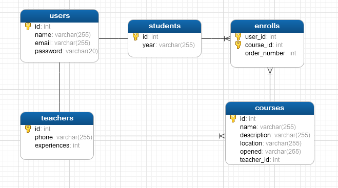

# Bùi Công Hoàng
## Khoá học Clean Code - Luvina 2020


## Phần 1: Clean Code căn bản
1. 5 mục tiêu chính của Clean Code là

2. Đáp án của tôi là team C bởi vì:
   - Team A áp dụng clean code muộn, sau khi đã release version đầu tiên. Khi có việc refactor code sẽ mất rất nhiều công số, có thể có sai sót
   - Team B áp dụng clean code quá sớm, có thể bị trễ dealine release do clean code có nhiều kỹ thuật phức tạp, cần nhiều công số để thực hiện
   - Team C cân bằng giữa việc áp dụng clean code và công số xử lý. Đây là lựa chọn phù hợp nhất
3. Clean code tuy phức tạp và có thể gây tốn công số phát triển. Tuy nhiên mục tiêu của clean code là giúp code dễ đọc, dễ maintain, dễ nâng cấp hệ thống, giảm số dòng code, tái sử dụng code, dễ dàng.

Nếu ta sử dụng clean code hợp lý thì những người sau khi maintain code của mình sẽ dễ dàng hơn rất nhiều, ngược lại nếu không sử dụng clean code thì khi phát triển hệ thống thì code sẽ bị phình to, công việc maintain sẽ rất vất vả và tốn công số.
4. Đề xuất của Vân phù hợp với quy ước trong Clean Code.

5. 
```Java
public class User {
   private long id;
   private String fullName;
   private ArrayList<Post> posts;  //Một người có thể viết nhiều Post
   private ArrayList<Comment> comments; //Một người có thể bình luận nhiều Comment

   void writePost(Post post) {
      posts.Add(post);
   }

   void deletePost(Post post) throws PostException {
      try {
         posts.remove(post);
      } catch (PostException e) {
         throw e;
      }
   }

   void writeComment(Comment comment) {
      comments.Add(comment);
   }

   void deleteComment(Comment comment) throws CommentException {
      try {
         comments.remove(comment);
      } catch (CommentException e) {
         throw e;
      }
   }
}

public class Post {
   private long id;
   private String title;
   private String content;
   private User author; //Tác giả của bài viết
   private ArrayList<Comment> comments; //Một post chứa nhiều Comment

   void addComment(Comment comment) {
      comments.Add(comment);
   }

   void deleteComment(Comment comment) throws CommentException {
      try {
         comments.remove(comment);
      } catch (CommentException e) {
         throw e;
      }
   }
}

private class Comment{
   private long id;
   private String title;
   private Post post; //Bài viết mà comment gắn vào
   private User author; //Tác giả của comment
}
```

## Phần 2: OOP và SOLID
### 1. Hãy lập trình Java để thực hiện thiết kế như hình vẽ
[Mã nguồn bài 1](graphics_editor)

### 2. Composition over Inheritance và DI


## Phần 3: Thiết kế CSDL Quan hệ theo đặc tả

## Phần 4: Thiết kế RESTful API

## Phần 5: Lập trình Restful API

## Trắc nghiệm
1. C
2. B
3. D
4. C
5. A
6. B
7. A
8. A
9. B
10. A
11. B
12. C
13. B
14. B
15. D
16. B
17. D
18. A
19. B
20. B
21. B
22. B
23. B
24. C
25. C
